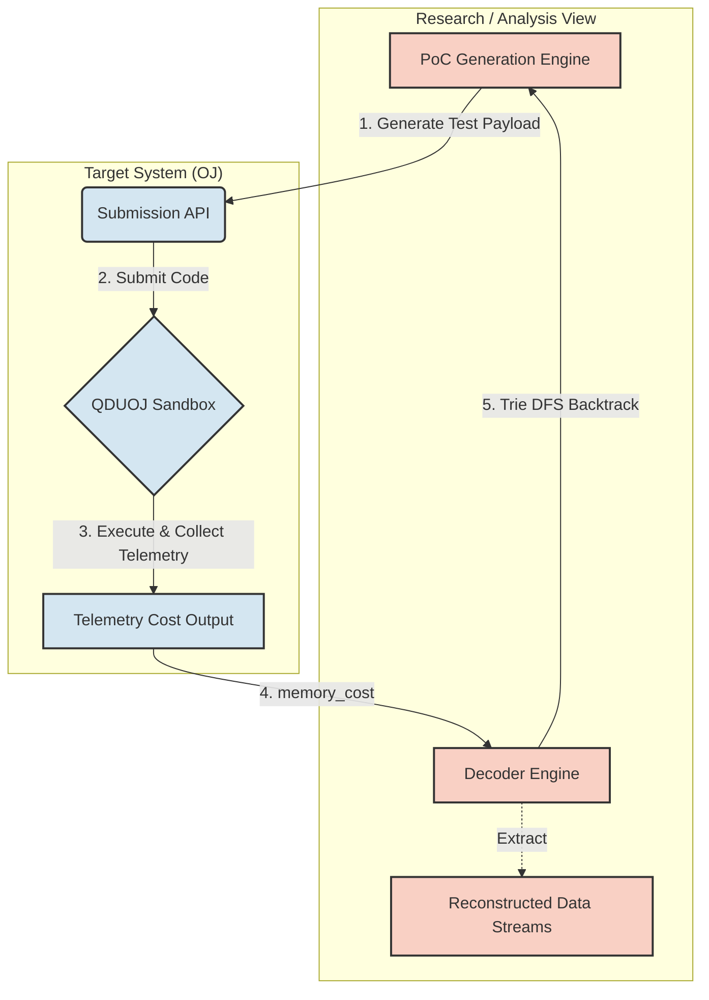

# 🎯 JudgeSCA: Side-Channel Information Leakage on Evaluation Platforms

[](#)
[%20Trie%20DFS-success.svg)](#)
[](#)
[](#)
[](#)

> **Project Positioning:** A White-Hat Cybersecurity Research & Mitigation Verification Framework for Automated Evaluation Platforms (Online Judges).

## 🚨 The Covert Channel Risk (Abstract)
Online Judge (OJ) platforms evaluate untrusted code inside highly restrictive sandboxes (no network, no file access). However, JudgeSCA demonstrates that researchers can leverage the **hardware telemetry data (specifically, peak memory consumption)** returned by the judge as a high-bandwidth side-channel to reliably reconstruct hidden data streams without direct file access.

## ✨ Key Highlights & Empirical Results

- 📈 **Absolute Physical Determinism:** Achieved a Linear Regression coefficient of **$R^2 = 1.0000$**, proving that telemetry quantization can be perfectly mapped to data sequences.
- 🚀 **$O(N)$ Algorithmic Breakthrough:** Extracted 7 parallel hidden data streams (39 characters) in exactly **48 submissions** using a Lexicographical State Machine, shattering the traditional $O(N \cdot |\Sigma|)$ blind-search limit.
- 🎯 **100% Extraction Accuracy:** Maintained **0.0% Bit Error Rate (BER)** with a throughput of 0.82 Bytes/sec, even when simulating aggressive Web Application Firewall (WAF) rate-limiting delays (2.0s).
- 🛡️ **Zero-Cost Mitigation Verified:** Proposed and validated a 1-line C-level patch (16MB Coarse-Grained Quantization) that definitively destroys the covert channel with minimal engineering overhead.

---

## 🛠️ Core Techniques (Methodology)

To achieve the results above, this project integrates cross-disciplinary techniques ranging from low-level systems to data science:

1. **Deterministic Payload Engineering:**
   * To transmit data through the side-channel, the payload must perform deterministic memory allocations while bypassing compiler optimizations (e.g., Dead Code Elimination). We demonstrated this using C++ as an example, employing `volatile` memory pinning to guarantee our telemetry payload isn't optimized away.
2. **$O(N)$ Extraction Algorithm (Trie DFS & LCP Backtracking):**
   * OJs universally return the *maximum* memory cost across all testcases. By conceptualizing the hidden testcases as a Trie (Prefix Tree), this behavior allows us to implicitly traverse the tree in descending lexicographical order (DFS) without naive alphabet scanning. Upon reaching a leaf node (a fully extracted testcase), we query the Longest Common Prefix (LCP) to instantly backtrack to the previous branching point, sequentially reconstructing all data streams in $O(N)$ complexity.
3. **Data Science & Statistical Analysis:**
   * **Linear Regression Calibration:** Dynamically mapped ASCII data values to exact memory allocations, neutralizing the sandbox's baseline environmental noise ($\sim 60\text{ KB}$) to isolate the target signal ($\sim 1.8\text{ MB}$ per char).

---

## 🏛️ System Architecture

The following diagram illustrates the end-to-end data stream reconstruction workflow.



---

## 🛡️ Defenses & System Tradeoffs

This framework also evaluates standard mitigation strategies to balance platform security and utility:

1. **Coarse-Grained Quantization (16MB Alignment):** 
   * **Result:** 100% mitigation (residual variance spikes to 4.65MB).
   * **Tradeoff:** Students lose fine-grained memory optimization feedback. (Recommended Patch).
2. **Differential Privacy (Gaussian Noise $\sigma=2\text{MB}$):**
   * **Result:** Destroys channel linearity.
   * **Tradeoff:** Legitimate submissions near the memory limit might suffer random MLE (Memory Limit Exceeded) judgments.

---

## 🚀 Artifact Appendix & Automated Reproduction

For full academic rigor, mathematical proofs, and details, please refer to the deep-dive whitepaper: **[RESEARCH_REPORT.md](RESEARCH_REPORT.md)**.

To ensure perfect reproducibility, JudgeSCA provides a one-click Proof-of-Concept and data visualization module:

```bash
# 1. Execute end-to-end multi-testcase reconstruction PoC
uv run poc/main.py --url http://localhost:80 --user root --password rootroot --problem 1

# 2. Automatically generate academic PDF vector charts (Figure 1-3)
uv run analytics/visualize.py
```

---

## 🛑 Academic Disclaimer & Ethical Notice

- **Educational Purpose Only:** This project is strictly for cybersecurity research and educational purposes regarding software side-channel mitigations.
- **Responsible Disclosure:** All experiments and tests in this research were executed within a **locally isolated Docker sandbox** (QDUOJ Docker). All test cases were **thoroughly anonymized**, and we **never probed or interfered with any online production systems**.
